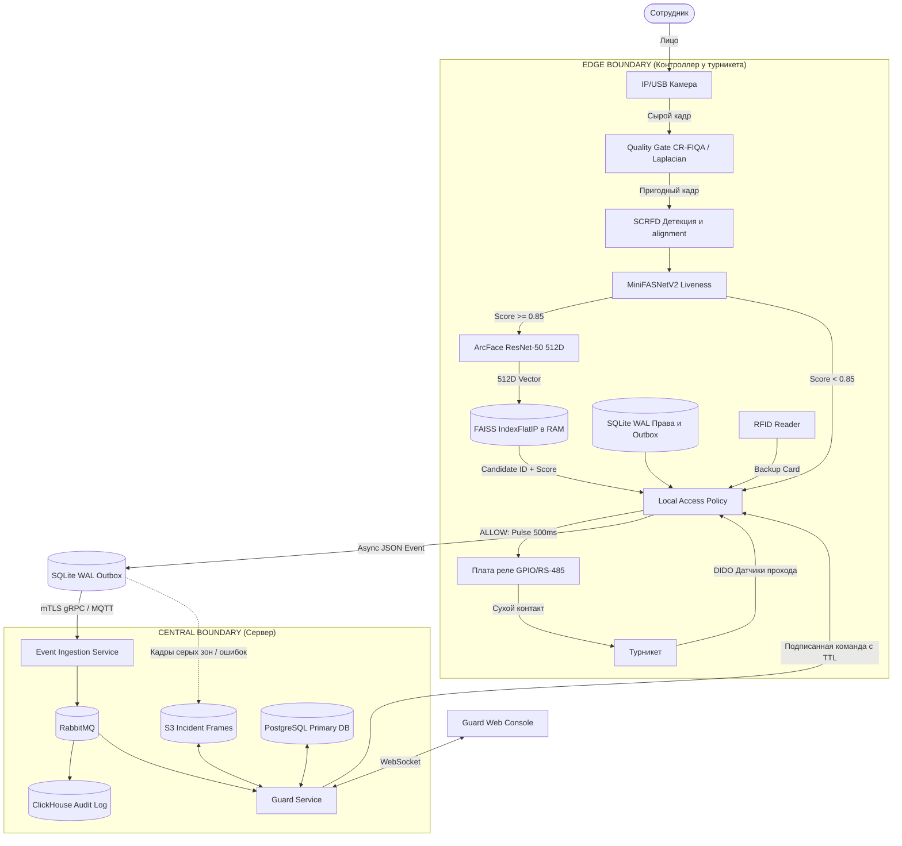

# Target Architecture

## 1. System Overview & Core Components

Система контроля и управления доступом (СКУД) выполняет распознавание лиц на локальном Edge-контроллере у турникета, проверяет признак живого присутствия (Liveness), сопоставляет биометрический вектор с локальным индексом, проверяет права доступа и управляет реле турникета.

### Компоненты системы

| Контур | Компонент | Ответственность |
|---|---|---|
| **Edge Boundary** | IP/USB-Камера | Захват видеопотока, нарезка кадров, контроль яркости и размытия (CR-FIQA / Laplacian). |
| | Edge-Вычислитель | Запуск нейросетей (SCRFD, MiniFASNetV2, ArcFace ResNet-50), принятие решения, локальная синхронизация. |
| | FAISS IndexFlatIP (RAM) | Оперативный векторный индекс до 12 000 нормализованных 512D-эмбеддингов в оперативке. |
| | SQLite WAL | Локальное хранилище проекции прав, буфер неотправленных событий аудита и кэш кадров инцидентов. |
| | Плата DIDO / Реле | Физическое управление турникетом (сухой контакт NC/NO, pulse 500 мс), считывание оптических датчиков прохода. |
| | RFID/NFC-Считыватель | Резервный физический проход по картам при сбоях биометрии или отсутствии кадров. |
| **Central Boundary** | Access & Profile Service | CRUD сотрудников, ролей, расписаний и зон доступа (PostgreSQL). |
| | Biometric Template Service | Хранение эталонных биометрических шаблонов, версионирование и сборка master-индексов FAISS. |
| | Event Ingestion Service | Прием событий с Edge по mTLS (gRPC/MQTT), проверка схем и дедупликация. |
| | RabbitMQ | Шина сообщений для развязки приема событий от записи в БД и алертинга. |
| | ClickHouse | Неизменяемое аналитическое хранилище всех событий аудита. |
| | S3 Storage | Зашифрованное хранилище кадров инцидентов, ошибок Liveness и серых зон. |
| | Guard Service & Web Console | Сервис уведомлений и интерфейс охраны для ручного подтверждения прохода по WebSocket. |

---

## 2. Edge vs Central Responsibility

### Ответственность Edge-контура

* Захват кадров и отбраковка непригодных изображений (CR-FIQA / Laplacian blur).
* Детекция лица и выравнивание по ключевым точкам (SCRFD).
* Проверка признака живого присутствия (MiniFASNetV2, порог >= 0.85).
* Извлечение 512D-эмбеддинга (ArcFace ResNet-50) и L2-нормализация.
* Поиск Top-K кандидатов в локальном FAISS IndexFlatIP (Inner Product).
* Проверка временных расписаний, зон доступа, статуса сотрудника и локального Anti-passback.
* Формирование управляющего импульса на плату реле (500 мс).
* Асинхронная запись события в буфер SQLite WAL.

**Причина выноса на Edge**: Обеспечение задержки p95 < 100 мс, полная автономность точки прохода при обрыве сети до 24 часов, соблюдение приватности (сырой видеопоток не передается по сети).

### Ответственность Central-контура

* Единый источник истины (Single Source of Truth) для профилей сотрудников, карт, ролей и прав.
* Хранение первичных биометрических шаблонов и их версий.
* Генерация и подписанная дистрибуция новых версий индексов FAISS и снимков прав на Edge.
* Прием, дедупликация и долгосрочное хранение логов прохода в ClickHouse.
* Хранение зашифрованных кадров инцидентов в S3.
* Рассылка уведомлений о событиях Серой зоны (Gray Zone) на пульт охраны.

**Причина выноса в Central**: Ограниченность ресурсов Edge-устройств, централизованное администрирование, длительный retention аудита и межобъектная аналитика.

---

## 3. Synchronous Hot Path vs Asynchronous Cold Path

### Синхронный горячий путь (Hot Path)

Горячий путь исполняется строго на Edge-контроллере и не имеет сетевых зависимостей.

```text
Кадр с камеры
  -> Quality Gate (CR-FIQA / Laplacian blur)
  -> SCRFD (Детекция + Landmarks)
  -> MiniFASNetV2 (Liveness score >= 0.85)
  -> ArcFace ResNet-50 (512D Embedding)
  -> FAISS IndexFlatIP (Top-K Search)
  -> Local Access Policy & Anti-passback
  -> GPIO / RS-485 Output (Импульс 500 мс)
  -> Открытие турникета
```
# Архитектура биометрической системы контроля доступа (СКУД)

## 1. Требования и режим работы

Жёсткий дедлайн принятия решения — 150 мс. При отказе, отключении или неработоспособности биометрических моделей точка прохода переходит на доступ по RFID/NFC-картам. Однако во время активного биометрического инференса (пока нейросеть обрабатывает текущий кадр) считывание RFID-карты блокируется до завершения цикла или наступления таймаута во избежание гонки состояний и двойных срабатываний.

## 2. Асинхронный холодный путь (Cold Path)

1. Edge записывает событие прохода в локальную очередь SQLite WAL.
2. Фоновый поток-отправщик вычитывает события и отправляет их по mTLS (gRPC/MQTT) в Event Ingestion Service.
3. Event Ingestion публикует валидированное сообщение в RabbitMQ.
4. Audit Consumer сохраняет событие в ClickHouse.
5. При наличии кадра инцидента (Gray Zone / Liveness Fail) Edge загружает зашифрованный файл напрямую в S3.
6. Notification Service передает карточку инцидента в Guard Web Console по WebSocket.
7. Центральный сервис отправляет подтверждение (ACK), после чего Edge помечает запись в SQLite как отправленную.

## 3. Data Storages

### 1. PostgreSQL (Central)
* **Назначение:** Канонический реестр сотрудников, ролей, зон доступа, расписаний, хэшей RFID-карт, устройств и версий биометрических шаблонов.
* **Безопасность:** Номера карт хранятся в виде HMAC-хэшей. Эмбеддинги защищены политикой RBAC.

### 2. FAISS IndexFlatIP (Edge RAM)
* **Назначение:** Оперативный поиск 1-to-N по нормализованным 512D-векторам float32.
* **Режим:** IndexFlatIP (Inner Product, эквивалентный Cosine Similarity для нормализованных векторов) для баз до 12 000 человек.

### 3. SQLite WAL (Edge)
* **Назначение:** Транзакционный буфер на Edge.
* **Структура:** Таблицы `outbox_events` (очередь событий), `rights_snapshot` (локальная копия прав), `anti_passback` (кэш недавних проходов) и `media_cache` (временные зашифрованные кадры).

### 4. ClickHouse (Central)
* **Назначение:** Долговременный неизменяемый журнал событий (Audit Log).
* **Схема:** Партиционирование по датам, сортировка по `(site_id, gate_id, occurred_at, event_id)`. Дедупликация по `event_id`.

### 5. S3 Storage (Central)
* **Назначение:** Хранение кадров инцидентов (Серая зона, ошибки Liveness, сбои).
* **Политика:** Кадры успешных автоматических проходов по умолчанию НЕ сохраняются и НЕ передаются в S3.

## 4. Guard Manual Review Interface (Gray Zone)

### Пороги Cosine Similarity

| Диапазон Score | Решение | Действие системы |
| :-- | :-- | :-- |
| score >= 0.65 | ALLOW | Автоматическое открытие турникета (при Liveness >= 0.85). |
| 0.50 <= score < 0.65 | REVIEW_REQUIRED | Серая зона. Турникет закрыт, кадр отправляется охране. |
| score < 0.50 | DENY | Доступ запрещен (UNKNOWN_FACE). |

### Поток обработки Серой зоны

1. Edge фиксирует score в диапазоне 0.50..0.65 и заносит событие в SQLite.
2. Кадр инцидента загружается в S3, а событие передается в Guard Service.
3. В Guard Web Console всплывает карточка: текущий кадр с камеры, эталонное фото из БД, ФИО и табельный номер сотрудника, точка прохода и время. Численные математические скоры (score / liveness) охране не отображаются, чтобы не создавать информационного шума.
4. Охранник нажимает «Допустить» или «Отклонить».
5. Guard Service генерирует одноразовую подписанную команду с коротким TTL (5 секунд) и передает её на Edge.
6. Edge проверяет подпись, TTL, валидность сессии и локально активирует реле.
7. При отсутствии связи с сервером удаленное ручное подтверждение недоступно; охранник использует локальный RFID-считыватель или физический ключ.

## 5. Fallback Modes & Degraded Operations

| Сценарий сбоя | Обнаружение | Поведение системы | Восстановление |
| :-- | :-- | :-- | :-- |
| Потеря связи с Central | Таймаут gRPC/MQTT | Полная автономная работа по FAISS и SQLite. События накапливаются на Edge. | Фоновая отправка накопившегося backlog с ограничением скорости после поднятия сети. |
| Истечение TTL снимка прав (24 ч) | now - last_sync > 24h | Fail-secure для биометрии. Проход только по RFID-картам / через охранника. | Автоматическая загрузка и атомарная активация свежего снимка. |
| Отказ камеры / отсутствие кадров | FPS = 0 / No Signal | Отключение биометрического конвейера. Переход на RFID-карты. | Резервный проход по RFID/NFC-картам до восстановления видеопотока. |
| Низкий Liveness (< 0.85) | liveness_score < 0.85 | Автоматический доступ запрещен (LIVENESS_FAILED). | Ручная проверка охраной или проход по RFID-карте. |
| Переполнение диска Edge | Заполнение > 85% | Очистка подтвержденных (ACKed) событий и старых кадров. Логи без кадров сохраняются. | Выгрузка backlog на сервер. |
| Повреждение FAISS-индекса | Ошибка подписи / Checksum | Откат на предыдущую валидную версию индекса. | Повторная скачка актуального индекса с сервера. |

## 6. Architectural Diagrams (Mermaid)

### Диаграмма компонентов и потоков данных


